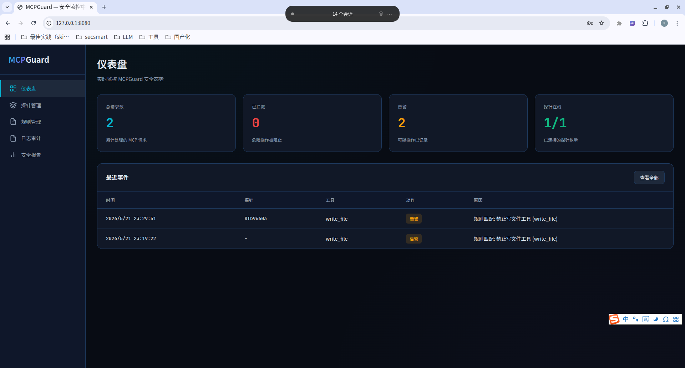

# MCPGuard

MCP 安全护栏 — 双向拦截 Agent 工具调用，检测并拦截不安全操作。

## 功能

- **MCP Proxy**：透明拦截 MCP JSON-RPC 请求与响应
- **规则检测**：基于文件路径、命令关键词、正则的快速过滤
- **LLM 检测**：用 LLM 判断模糊场景（Prompt 注入、社会工程等）
- **策略管理**：用户可配置拦截策略（静默拦截 / 拦截+确认 / 仅告警）
- **Web 管理界面**：配置面板 + 实时日志 + 安全报告

## 平台界面



## 快速开始

```bash
# 构建
go build -o mcpguard ./cmd/mcpguard

# 运行
./mcpguard serve
```

## 技术栈

Go 1.24 / React / MCP Protocol
